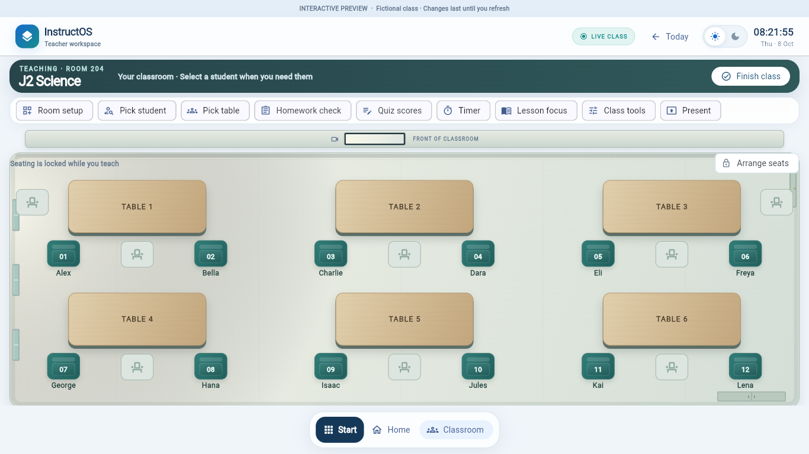
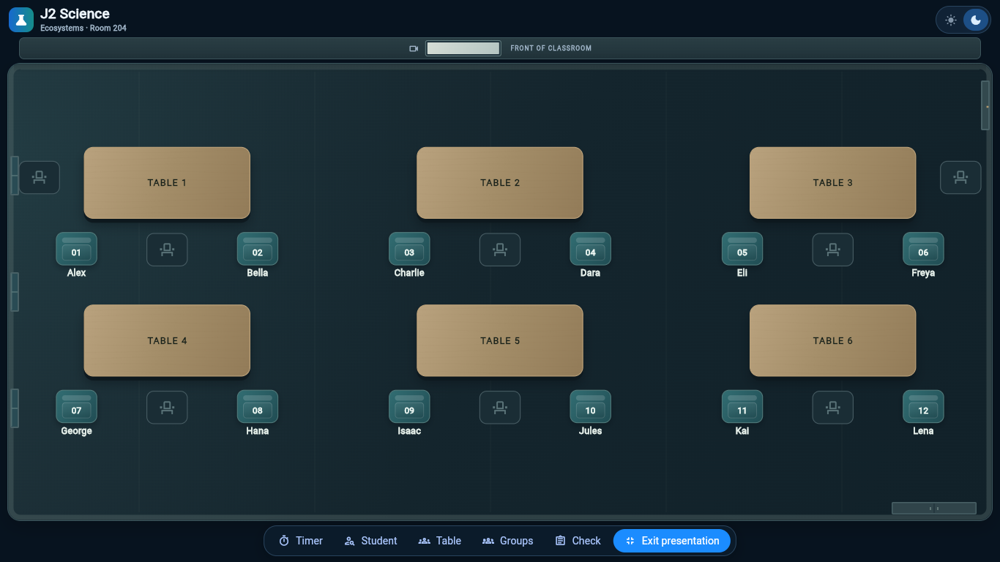

# Room boundary refinement — 8 October 2026

The owner-approved premium version is preserved by the pushed annotated tag **`recovery/classroom-premium-checkpoint-20261008`**, pointing to `72ad2d7`. Its review branch remains unchanged. This checkpoint is the new visual baseline; the earlier plain classroom is not a restoration target.

The refinement lives on the separate branch **`recovery/classroom-boundary-refinement-20261008`**. No merge, deployment or protected-branch changes.

## Bounded refinement

- Reproportioned the existing front screen within the same front-wall height. A pale, neutral projection surface distinguishes it from the previous elongated dark glass strip. No mock lesson content or new projector furniture was added.
- Added a shallow front-wall return/contact shadow and strengthened the existing skirting. The floor boundary reads more clearly while remaining inside its original bounds.
- Muted the existing lesson banner's gradient so furniture and student identities receive more visual attention. Text, controls and banner dimensions are unchanged.
- Introduced `TeachingPreviewEnvironmentStyle`, a paint-only profile for the existing provisional window count, door/storage visibility and light origin. Defaults preserve the approved fixtures. Both themes and modes consume the same profile.

## Protected baseline

The entire student-seat widget is unchanged. Table materials and oak-grain drawing are byte-for-byte unchanged. Furniture sizes, table/seat layout, student identities, assignments, status colours, Class Tools architecture and record handlers remain fixed.

At 1366×768, measured occupied-seat centers differ by **0.000 px** from the approved premium baseline in both normal themes. The actual-browser check confirms all six tables and twelve occupied targets fit in both themes and modes without routine scrolling.

## Actual screenshots

Before is the owner-approved premium baseline; after is the current release build. All captures use the same 1366×768 viewport and font workaround.

| State | Approved baseline | Refinement |
| --- | --- | --- |
| Normal light | [Before](classroom-recovery/20261008-boundary/before-normal-light.png) | [After](classroom-recovery/20261008-boundary/after-normal-light.png) |
| Normal dark | [Before](classroom-recovery/20261008-boundary/before-normal-dark.png) | [After](classroom-recovery/20261008-boundary/after-normal-dark.png) |
| Presentation light | [Before](classroom-recovery/20261008-boundary/before-presentation-light.png) | [After](classroom-recovery/20261008-boundary/after-presentation-light.png) |
| Presentation dark | [Before](classroom-recovery/20261008-boundary/before-presentation-dark.png) | [After](classroom-recovery/20261008-boundary/after-presentation-dark.png) |

## Verification

Flutter 3.38.9 release preview build passed. All seven scoped test files: **14 passed, 9 failed**, with exactly the same failed names as the premium baseline. The five density tests and focused record/seat-swap regression pass. All ten original cases remain in [the separate failure tracker](classroom-preview-existing-failures.md), including the one currently passing case; the suite is not fully passing.

The real-browser check passed all four viewport states, bottom Class Tools and right-hand student-panel checks. No uncaught app exceptions were observed. Analyzer retains four existing unused-declaration warnings, no errors, exit 1. `git diff --check` passed. Logs and measured bounds are retained under `/workspace/artifacts/classroom-recovery/boundary-*`.

The cached Roboto interception remains the same disclosed capture workaround as the baseline. Ordinary external font loading and the separate browser note-retention path remain unverified; see the premium report and failure tracker. No records/editor handlers changed in this refinement.

## Real classroom references

The existing environmental cues are provisional, not a claim about the owner's real classroom. Photographs or video should determine actual boundary proportions, window/door placement, projector/screen treatment, storage appearance and lighting. The shared paint profile and front-wall renderer can change independently of furniture geometry and student state. There are no new physical feature types or invented props in this pass.

When references arrive, map them onto the approved visual language and existing seating. Add placement/material parameters only where the references require them. Do not recreate the furniture, move students, or replace the room with a new concept. Preserve another checkpoint before reference-driven changes.

## Assessment

This is a modest refinement of the approved appearance: a clearer screen, better-defined perimeter and quieter banner hierarchy. It preserves the material quality and student identity of the baseline. The screen and room cues remain simplified and should be informed by the real classroom references before more literal architectural detail is introduced. The approved premium baseline remains the recovery anchor; this refinement is pending owner review.
