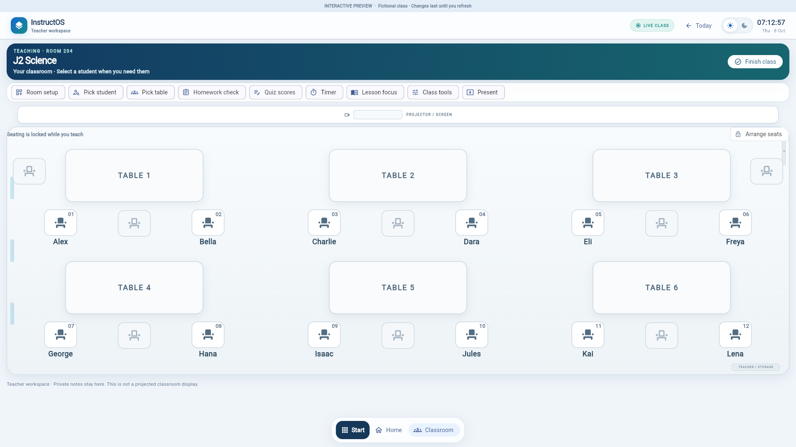
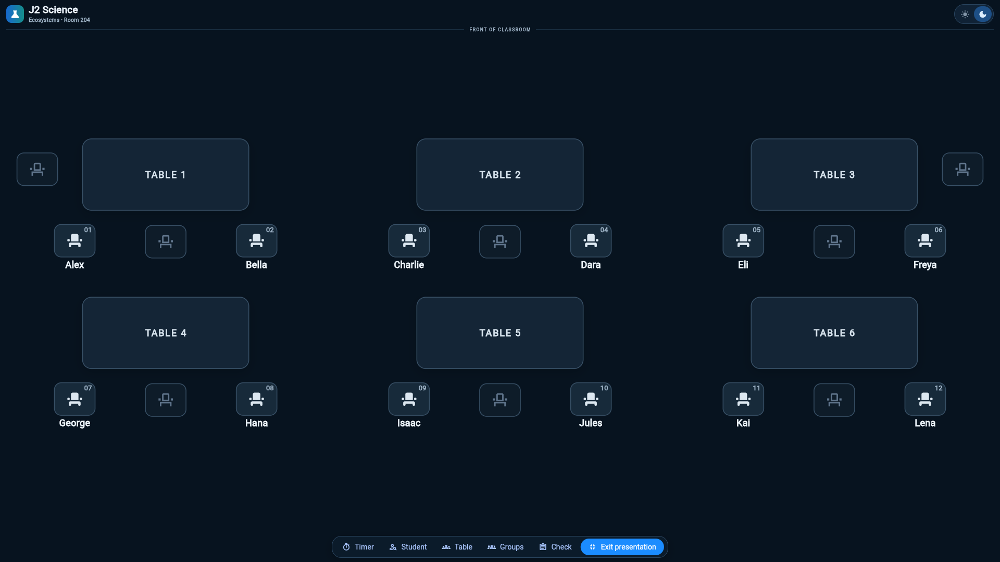

# Classroom density and scale pass — 8 October 2026

Recovery branch: `recovery/classroom-density-review-20261008`. Implementation: `2eb53ab`. Baseline: `779b1ce`, following the first compact-presentation pass. Flutter **3.38.9**, Dart **3.10.8**. No merge or deployment.

## 1. What I found

Normal mode used responsive cell widths with fixed furniture heights, chair sizes and text sizes. At 1920×1080 this produced a very wide, shallow classroom ending around y688, followed by substantial unused space. The first presentation pass removed the stretched aisle but left furniture and labels visually weak. Existing storage decoration overlapped the last student's name.

## 2. Why the current version fails visually

The cells expand without increasing the presence of their contents. Small student names and markers appear disconnected from broad tabletop surfaces, while the banner and action strip dominate the composition. A compact aisle alone does not establish classroom hierarchy. Existing room cues are still restrained and diagram-like; this pass does not claim to resolve their appearance.

## 3. What changed

- Normal mode now fits a canonical 480-unit table-and-seat group to each responsive cell. Furniture, names, numbers and status controls scale together instead of leaving fixed-size tokens in expanding cells.
- Increased tabletop depth (normal 74→100 units; presentation 88→108), tabletop width factor (.68/.72→.88), chair dimensions (48×40 / 56×46→62×50), slot width (64/72→80), name text (10.5/12→14), table labels (11/14→14) and seat numbers (8/9→10). These are source dimensions before composition scaling.
- Retained compact row gaps and the existing presentation centering and scrolling behavior.
- Reserved 32 pixels below normal-mode seating so the existing storage badge clears student labels.

At 1920×1080, the normal room extends to roughly y905. The extra height comes primarily from larger furniture and student groups, with a small clearance for storage. Names and seat numbers are materially more readable. Presentation tables have more depth and the six-table composition remains coherent.

## 4. What I deliberately did not change

The default six-table order remains 1–2–3 above 4–5–6, with the front at the top. Seat-to-student IDs, three under-table slots, table 1's left side seat and table 3's right side seat, arrangement callbacks and records remain unchanged. Existing responsive column breakpoints remain unchanged.

No new furniture design, marker design, colors, environmental features, control design, private-panel architecture or bottom-tool architecture. No Firebase, auth, grade-entry workspace, dependency or lockfile changes. All captures use fictional preview students. The original checkout and preserved recovery branch are untouched.

## 5. What the before/after screenshots show

These are actual Chromium captures of release builds, not mockups. Each main capture is 1920×1080. GitHub renders these files and this report; the chat's local image viewer previously displayed “No image”.

| State | Before this pass | After this pass |
| --- | --- | --- |
| Normal, light | [Before](classroom-recovery/20261008-density2/before-normal-light.png) | [After](classroom-recovery/20261008-density2/after-normal-light.png) |
| Normal, dark | [Before](classroom-recovery/20261008-density2/before-normal-dark.png) | [After](classroom-recovery/20261008-density2/after-normal-dark.png) |
| Presentation, light | [Before](classroom-recovery/20261008-density2/before-presentation-light.png) | [After](classroom-recovery/20261008-density2/after-presentation-light.png) |
| Presentation, dark | [Before](classroom-recovery/20261008-density2/before-presentation-dark.png) | [After](classroom-recovery/20261008-density2/after-presentation-dark.png) |

Additional actual captures:

- 1440×960 Surface-like viewport: [normal light](classroom-recovery/20261008-density2/surface-normal-light.png), [normal dark](classroom-recovery/20261008-density2/surface-normal-dark.png), [presentation light](classroom-recovery/20261008-density2/surface-presentation-light.png), [presentation dark](classroom-recovery/20261008-density2/surface-presentation-dark.png).
- 1366×768: [normal initial viewport](classroom-recovery/20261008-density2/1366-normal-light.png), [normal after a short scroll](classroom-recovery/20261008-density2/1366-normal-light-scrolled.png), [presentation](classroom-recovery/20261008-density2/1366-presentation-light.png).
- 1366×768 functional checks: [tools open](classroom-recovery/20261008-density2/1366-tools-open.png), [Alex selected with the private panel on the right](classroom-recovery/20261008-density2/1366-student-panel.png).

At 1366×768, normal mode requires a short scroll to see rear-row names because the existing header, banner and controls consume much of the height. The scrolled capture confirms access to all six tables and names. Presentation fits all six tables. This limitation remains visible rather than being hidden by a cropped screenshot.

### Validation

- Release standalone teaching-preview web build: **passed**, including the storage-clearance fix.
- Five density tests: **passed**. Three presentation viewport checks preserve row/column alignment and physical side seats; one short-height test verifies scrolling with status controls; the new normal desktop check verifies larger names, compact rows, side-seat positions and unchanged assignment list.
- Broader five preview suites plus density tests: **12 passed, 10 failed**. Failed-test names exactly match the previously recorded ten baseline failures; no new failed test names. These existing failures include narrow projector overflow, stale exact-text expectations, animation timing and duplicate status text. See the initial report for diagnosis. This is not a green full-suite result.
- Analyzer: **four existing unused-declaration warnings, no errors**, exit 1. Unchanged warning set.
- Browser: captured both themes and modes at three viewport sizes; opened tools and selected Alex to verify the right-hand private panel. No uncaught page exceptions recorded. The existing Google sign-in script request remains blocked; this fictional fixture does not use it.
- Same font workaround for before and after: Chromium serves cached Roboto Regular from a hash-verified pub dependency when the engine requests blocked fonts.gstatic.com. No app font assets were changed. Ordinary external font loading remains unverified.
- `git diff --check`: passed. Logs retained in `/workspace/artifacts/classroom-recovery/density2-*.log`.

## 6. Is it good enough?

This is a useful, bounded improvement in scale, legibility and desktop canvas use. It is ready for owner review as an incremental density pass. It is **not** claimed to restore the approved premium appearance or to satisfy final visual approval.

Normal mode at shorter desktop heights still warrants a focused composition pass: reducing the prominence and height of existing chrome would help more than adding decoration. Presentation still has broad outer margins, and the furniture/environment retain their current restrained visual treatment. Further changes should follow review of these actual captures and remain separate from unrelated workflow repairs.

### Review and environment status

Implementation and evidence remain on the isolated recovery branch. GitHub API access previously prevented creating a draft PR; the branch and report provide reviewable evidence. No protected branches were changed. Flutter setup and reusable startup instructions are saved in the environment configuration draft; saving the draft does not apply or publish it. Fresh-task restoration of the linked recovery worktree has not been independently verified.
