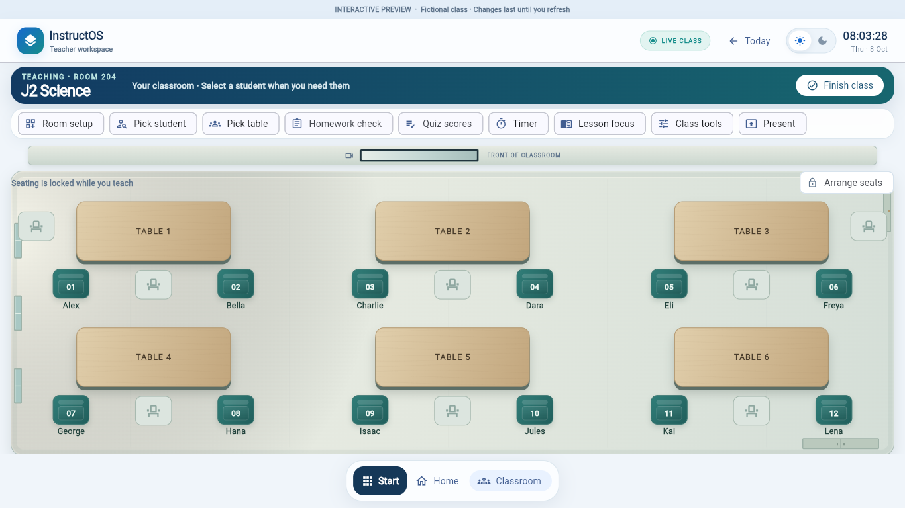
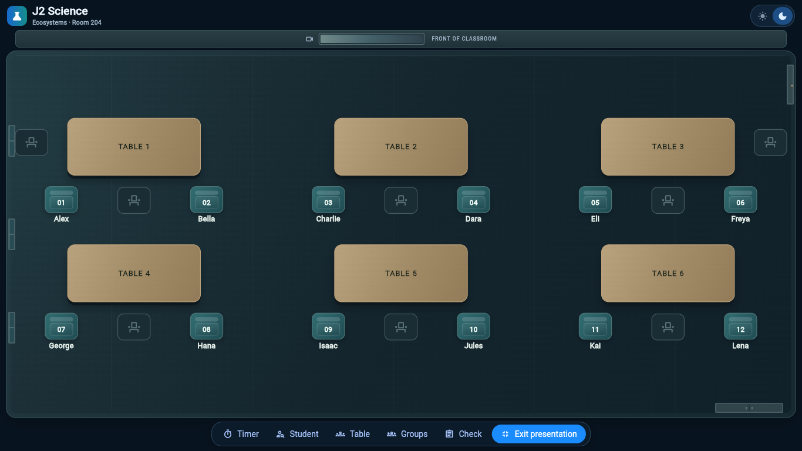

# Premium classroom visual recovery — 8 October 2026

**Result:** one implemented visual pass using the approved warm oak, deep teal and architectural-neutral direction. Actual release-build screenshots are below. Material presence, student identity and normal/presentation cohesion are stronger; final visual acceptance remains with the owner.

Branch: `recovery/classroom-density-review-20261008`. Reviewed density checkpoint: annotated tag `recovery/classroom-density-checkpoint-20261008`, pointing to `e3e790b`. Compact viewport implementation: `713d641`. Premium implementation: `4644b2e`. No merge, deployment or protected-branch changes.

## Direction and references

Before visual implementation, I inspected the recovered earlier screenshots, both shared-thread descriptions, the current four-state captures and the earlier table-accent implementation at `64e7c82`. The references consistently call for a clear front, room boundaries, material differences, controlled lighting and depth around the approved seating. The earlier code's six saturated table accents were evidence of lost colour, not a palette to restore wholesale. The original approved premium screenshot was not recoverable from those threads, so this is a grounded, owner-approved visual direction rather than a claimed pixel-exact restoration.

The owner approved **subtle modern oak, deep teal used intentionally, and architectural neutrals carrying the room** before the material implementation began. No standalone mockup was produced.

## What changed

### Viewport composition

At desktop widths of at least 900 and available classroom heights below 700, the existing class banner arranges its title and detail side by side. The projector/front strip and surrounding gaps become compact. Labels retain the density checkpoint's sizes. Existing scrolling remains available for smaller windows, expanded status rows and open tools; the default 1366×768 classroom no longer needs routine scrolling to reach rear-row students.

### Furniture and material quality

Tables retain their dimensions and footprint. Desaturated oak gradients, very low-contrast grain, a close tabletop edge, a darker frame edge and soft contact shadows distinguish them from white UI cards. The grain is subtle and deterministic; there is no rustic texture, new prop or additional furniture.

### Colour, markers and typography

Teal identifies occupied seats. Backrest and cushion details give the markers a more substantial seat form; the existing student number is centered and clearer. Empty seats remain subdued architectural neutrals. Names stay below their seats, with the existing 14-unit size and a more consistent semibold weight. Table-label tracking is tightened. Roboto remains the typeface; no new font family or asset dependency was added.

Oak supplies warmth, neutral surfaces supply the room, and teal anchors occupied seats. Existing blue selection, amber spotlight and homework/attendance state meanings remain separate. The palette is shared across normal and presentation modes.

### Room structure, lighting and themes

Both modes use the same floor material, room boundary, skirting, restrained joints and directional light. The existing three windows, door and storage cue are drawn as inset boundary fixtures. Floating storage/projector captions no longer stand in for fixtures. The existing front screen uses a framed glass treatment within the front wall, with an orientation label.

Light mode uses warm stone and softly lit oak; dark mode preserves the oak material under subdued light against slate neutrals. Presentation now has the same bounded room language as normal mode rather than furniture floating on a plain fullscreen background. No fake classroom props or new environmental feature types were added.

## What stayed fixed

- Six tables, 1–2–3 above 4–5–6, with the front at the top.
- Three under-table slots, the physical left-side seat at table 1 and right-side seat at table 3, all seat/student IDs and initial assignments.
- Furniture widths, heights, slot sizes and fitting ratios from the density checkpoint; this visual pass did not solve design quality by making everything bigger.
- Class Tools' bottom architecture, the right-hand private panel, existing controls, chooser, assessments, attendance, timers and record handlers.
- No changes to Firebase, auth, grade-entry workspaces, dependency declarations or lockfiles. The original checkout is clean and untouched.

The browser measured **0.000 px difference in normal-mode occupied-seat centers**, in both themes, between the compact viewport baseline and this material pass at 1366×768. Presentation uses the existing grouping and fitting logic; the front wall occupies its existing orientation area. Five existing density regressions still verify table alignment, physical side seats, assignment lists and short-height scrolling.

## Actual before/after captures

All images are actual Chromium captures of the standalone Flutter release preview using fictional students. Open the GitHub image links in a browser; this chat previously failed to display local image artifacts.

At **1920×1080**, before is the reviewed density checkpoint and after includes the premium pass:

| State | Before | After |
| --- | --- | --- |
| Normal light | [Before](classroom-recovery/20261008-premium/before-normal-light.png) | [After](classroom-recovery/20261008-premium/after-normal-light.png) |
| Normal dark | [Before](classroom-recovery/20261008-premium/before-normal-dark.png) | [After](classroom-recovery/20261008-premium/after-normal-dark.png) |
| Presentation light | [Before](classroom-recovery/20261008-premium/before-presentation-light.png) | [After](classroom-recovery/20261008-premium/after-presentation-light.png) |
| Presentation dark | [Before](classroom-recovery/20261008-premium/before-presentation-dark.png) | [After](classroom-recovery/20261008-premium/after-presentation-dark.png) |

At **1366×768**, before is the compact viewport fix before material changes, isolating the visual improvement:

| State | Before material pass | After material pass |
| --- | --- | --- |
| Normal light | [Before](classroom-recovery/20261008-premium/1366-before-normal-light.png) | [After](classroom-recovery/20261008-premium/1366-after-normal-light.png) |
| Normal dark | [Before](classroom-recovery/20261008-premium/1366-before-normal-dark.png) | [After](classroom-recovery/20261008-premium/1366-after-normal-dark.png) |
| Presentation light | [Before](classroom-recovery/20261008-premium/1366-before-presentation-light.png) | [After](classroom-recovery/20261008-premium/1366-after-presentation-light.png) |
| Presentation dark | [Before](classroom-recovery/20261008-premium/1366-before-presentation-dark.png) | [After](classroom-recovery/20261008-premium/1366-after-presentation-dark.png) |





Additional evidence: [1366 density checkpoint before the viewport fix](classroom-recovery/20261008-premium/1366-density-checkpoint-normal-light.png), [1440×960 normal light](classroom-recovery/20261008-premium/surface-normal-light.png), [1440×960 presentation dark](classroom-recovery/20261008-premium/surface-presentation-dark.png), [Class Tools open](classroom-recovery/20261008-premium/1366-tools-open.png), [private student panel](classroom-recovery/20261008-premium/1366-student-panel.png).

## Validation and separate failures

- Flutter **3.38.9**, Dart **3.10.8**. Standalone release web build passed.
- Five density tests and one focused records/seat-target regression passed. The latter uses real seat hit targets and confirms a synthetic note and homework state follow the student after switching panels and swapping seats.
- All seven scoped test files: **14 passed, 9 failed**. No newly failing names among the ten baseline cases. `Start menu opens timer and returns to narrow teacher desktop` now passes; the flexible front strip removes the previously observed narrow projector overflow. Existing assertions remain enabled and unchanged.
- All ten baseline cases remain individually tracked in [the separate failure tracker](classroom-preview-existing-failures.md), including the one currently passing case. This is not a green full-suite result.
- Analyzer: four unchanged unused-declaration warnings, no errors; exit 1.
- Automated real-browser check passed: all six table labels and twelve occupied student hit targets fit at 1366×768 in both themes and modes without scrolling; rows and columns remain aligned. Class Tools opens at the bottom, and Alex opens the private panel on the right. No uncaught app exceptions were observed.
- A separate automated browser note-retention probe was unsuccessful with both the new build and the checkpoint's journey source. That browser path is unverified and recorded separately in the tracker. The passing framework record test does not erase this observation. Record/editor handlers were not changed.
- `git diff --check` passed. Logs, measured bounds and capture helpers are retained under `/workspace/artifacts/classroom-recovery`.

Captures use the same previously disclosed font workaround before and after: the blocked Roboto request is served from a hash-verified cached pub dependency. No app font assets were altered. Ordinary external font loading remains unverified; the unused Google sign-in script still has a blocked request in this fictional preview.

The reusable browser check is `scripts/recovery/verify_classroom_viewport.cjs`. With the preview served internally on port 8770, the validated command was:

```bash
PLAYWRIGHT_CHROMIUM_EXECUTABLE_PATH=/usr/bin/chromium RECOVERY_ROBOTO_PATH=/workspace/.cache/pub/hosted/pub.dev/shared_preferences-2.5.3/extension/devtools/build/assets/packages/devtools_app_shared/fonts/Roboto/Roboto-Regular.ttf RECOVERY_CAPTURE_DIR=/workspace/artifacts/classroom-recovery node scripts/recovery/verify_classroom_viewport.cjs premium-1366
```

The font path is a current-environment capture workaround, not a portable application dependency. Omit it when ordinary Roboto loading is available. The script defaults to the installed Playwright browser; the executable override above selects this environment's system Chromium. No localhost preview link is offered.

## Objective visual assessment

| Criterion | Observable change | Assessment |
| --- | --- | --- |
| Furniture presence | Table edge, frame and contact shadow separate oak from floor | Stronger than the white-card baseline |
| Material and colour richness | Desaturated oak, teal occupied seats, neutral room | More coherent and purposeful; no per-table rainbow accents |
| Student identity | Centered numbers, seat form, consistent name weight | Clearer occupied/empty distinction without moving students |
| Room structure | Shared floor boundary, inset fixtures and front screen | Clearer orientation and depth; fixtures remain deliberately schematic |
| Mode cohesion | The same materials and lighting language in all four states | Substantial improvement over the previously bare presentation view |
| Usability | All default 1366×768 student targets fit without routine scrolling | Verified in the real browser; records test passes, broader failures remain open |

**Judgment:** this is genuinely stronger in material quality, colour intent and cross-mode cohesion. It is a coherent first premium pass rather than another size increase. The screen and boundary fixtures are still simplified, and the existing toolbar/banner remain prominent at large desktop sizes. Those are candidates for refinement after owner review; this pass does not claim to exactly reproduce the unavailable earlier premium screenshot or declare final visual acceptance.

Reusable environment startup instructions are saved as a draft with the latest report and test outcomes. Review, save and publish that environment configuration in settings to activate it; no application deployment was performed. Fresh-task restoration of the linked recovery worktree remains unverified.
